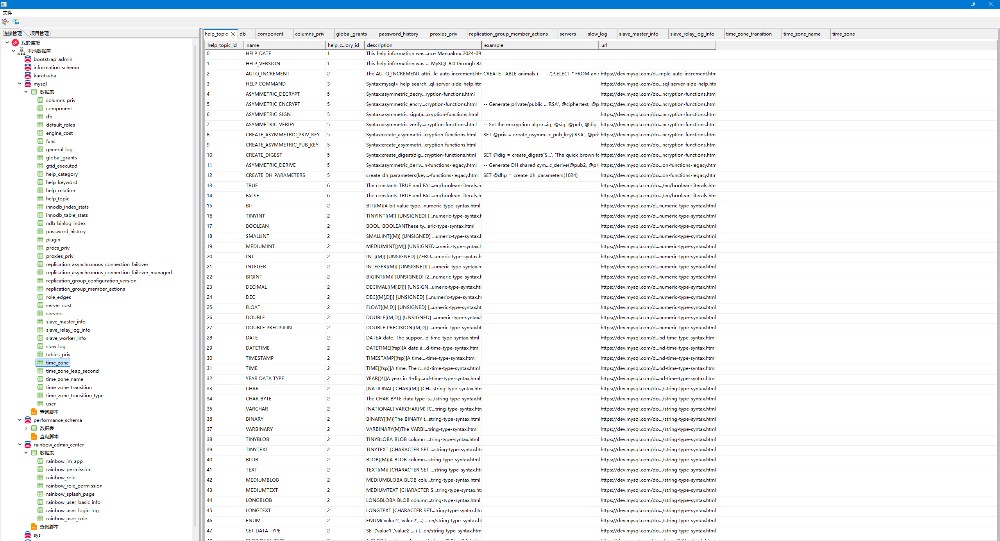

# SQL Studio – 智能数据库可视化管理工具

> 高效、直观、智能的数据管理与分析平台

## 产品简介
SQL Studio 是一款面向开发者、DBA 和数据分析师的高性能数据库可视化管理工具。通过统一界面，用户可以轻松浏览数据库结构、执行 SQL 查询、分析数据趋势，并实时监控数据库状态。

- **跨数据库支持**：兼容 MySQL、PostgreSQL、SQLite 等主流数据库
- **直观数据呈现**：表格、图表、报表多维度展示
- **智能分析辅助**：快速生成查询模板、可视化统计与排序
- **高效操作体验**：支持批量管理、拖拽调整、历史查询记录

## 功能演示

- 数据表结构直观浏览
- 快速执行 SQL 并可视化结果
- 支持数据筛选、排序、分组统计